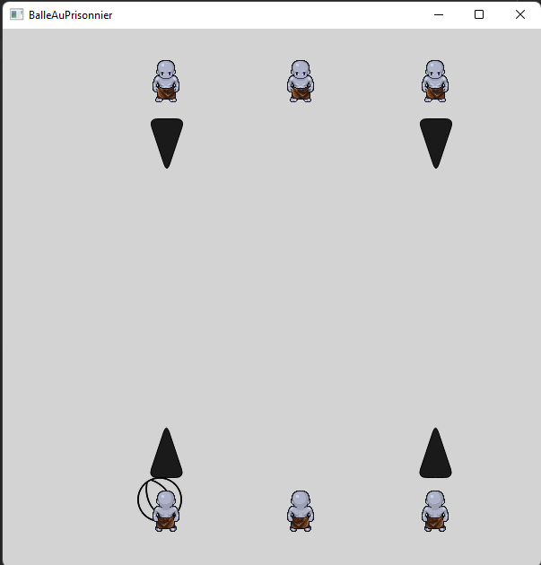
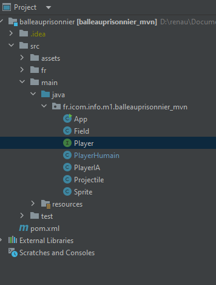

# Balle aux prisonnier en JAVA  
## Projet réalisé par Albane Nicoullaud, Morgan Raveleau et Vincent Renault
### Objectif : 
Créer un jeu de balle aux prisionners
### Description : 
Nous souhaitons réaliser une interface afin de permettre à des utilisateurs de jouer au jeu de la balle aux prisonniers.

### Comment récupérer le projet ?
Dans le git bash, rendez vous dans le dossier de votre choix  
Executez la commande : `git clone https://github.com/VincentMomo2022/projetCAPI.git`  
Executez la commande : `cd projetCAPI`  
Executez la commande : `git pull https://github.com/VincentMomo2022/projetCAPI.git`  

### Guide d'utilisitation: 
Le jeu se joue à deux, c'est un trois contre trois avec 2 ia dans chacune des équipes. 
Le joueur du haut se déplace avec les touche "Q" et "D", respectivement pour aller a gauche et a droite. Pour viser il utilisera les touches "Z" et "S", respectivement pour viser a gauche et a droite. Pour tirer, il utilise la touche 'espace'.  
Celui du bas se déplace avec les flèches droite et gauche du clavier. Il utilisera les flèches du haut et du bas pour viser et pour tirer, la touche 'entrée'.  
Vous pouvez quitter la partie à tout moment en appuyant sur la croix.  

Le but du jeu est d'envoyer le projectile sur le joueur adverse. L'équipe qui aura touchés ses trois adversaire en premier gagnera la partie. (Objectif pas encore atteint.)

### Structure du projet
Vous trouverez a la racine du repository le rapport PDF.  

Les fichiers sont divisés en 7 classes (App, Field, Player, PlayerHumain, PlayerIA, Projectile et Sprite), elles permettent le bon fonctionnement du jeu. 

La classe App sert de lancement du jeu, Field afin de préparer le terrain, Player est le constructeur pour les classes PlayerHumain (gère les joueurs humain) et PlayerIA (gère les joueurs artificiels), La classe Projectile traite la balle que les joueurs vont s'envoyer et la classe Sprite traitera des animations.

#### Voici l'arboressance du projet

### Retour d'experience

Ce fût un projet instructif qui a su nous sortir de notre zone de confort.  
Nous n’avions jamais codé en Java, il a fallu un travail personnel de la part de chacun afin de comprendre, utiliser et adapter le code fourni. De plus, l’utilisation de Javafx et Maven requiert une installation développée. Nous travaillons sur les ordinateurs de la fac et malheureusement nous étions souvent amenés à changer d’ordinateurs, nous devions à chaque fois réitérer l’installation ce qui nous a pris beaucoup de temps. Sachant que nous n’avions aucune connaissance en Java, recevoir un projet semi commencé avec des erreurs dans celui-ci a ajouté une complexité supplémentaire.  
Néanmoins, nous avons réussi à produire un résultat que nous trouvons satisfaisant pour la complexité du projet.   
Nous nous sommes retrouvés plusieurs fois dans les salles de la fac afin de mettre en commun, évaluer le travail à faire, le répartir, tout cela en estimant le temps, la difficulté et les facultés de chacun à réaliser les tâches.
